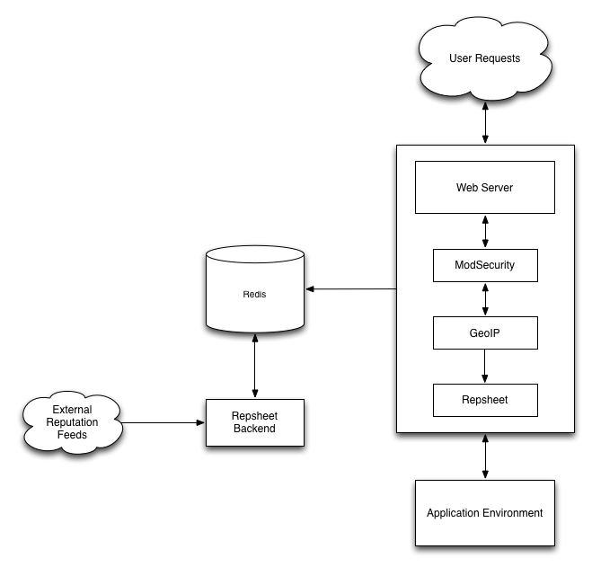

# Repsheet NGINX Module

> **noun**  *Slang.*
> A record kept by web site authorities of a machine's wrongdoings.
>
> **noun**  *Slang.*
> A necessary tool in your web defense arsenal.
>
> **Origin:**
> [2013]

## What problem does it solve?

Repsheet is a collection of tools to help improve awareness of robots
and bad actors visiting your web applications. It is primarily
composed of a core library, web server module, a backend automation
tool, and a web based visualization application.

Repsheet attempts to solve the problem of automated defenses against
robots and noisy attackers. Essentially, it is a local reputation
engine. As actors visit your application, the Repsheet module looks
them up in the cache. It is capable of looking up actors by IP address
or by cookie. If Repsheet finds the actor in the cache, it will act in
one of the following ways:

* Whitelist - allows the actor to proceed
* Blacklist - returns a `403` response
* Marked - notifies the downstream application of suspect behavior

The following diagram shows a complete Repsheet installation system
diagram. The backend, external reputation feeds, GeoIP, and
ModSecurity are optional components.

## Feature Differences from the Apache Version

The concept of what Repsheet should do is constantly evolving. There
are some differences between the NGINX and Apache modules and it is
important to make them as clear as possible.

#### The Unsupported

* This module does not have the recorder feature that the Apache
  version does. It will be implemented, but doesn't currently exist.

* This module does not support ModSecurity. The development of this
  support is blocked due to an incomplete implementation of
  ModSecurity for NGINX. The issue tracking this is
  https://github.com/SpiderLabs/ModSecurity/issues/660. Once this is
  resolved or the feature can be implemented in another way it will
  be.

* This module does not currently support GeoIP based lookups. There is
  nothing blocking this from happening, it just has not been
  implemented yet.
